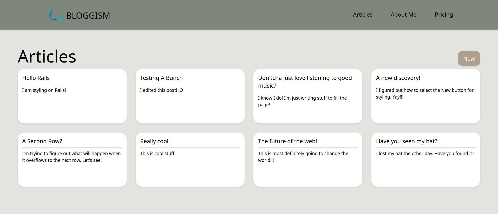
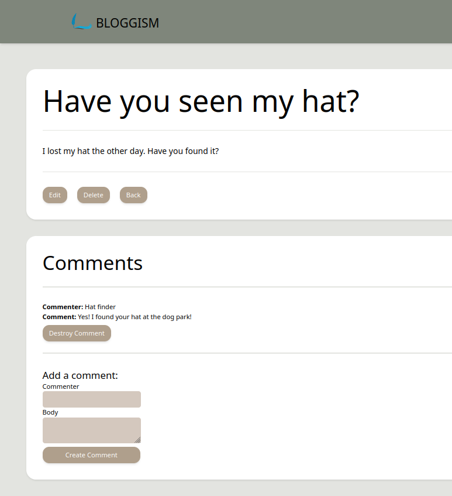

# Blog App

This project was created to put what I learned about the model, view, controller pattern to use.

I had a lot of help for this from [The Ruby on Rails Guides: Getting Started](https://guides.rubyonrails.org/getting_started.html). This rails guide is a big walkthrough of how to create a blog app like this.

This was a super useful guide to have for a first project. It held your hand and let you go on your own just enough.

### Functionality

* Has two static pages
* Can create new blog articles with a title and content
* Edit and delete articles
* Create or delete comments on articles
* Makes use of strong parameters
* Built in model validations

### Screenshots

  <figure>
    <figcaption>Blog Home Page</figcaption>
    
  </figure>
  <figure>
    <figcaption>Article Show View</figcaption>
    
  </figure>

